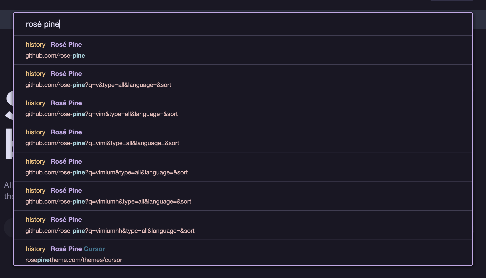
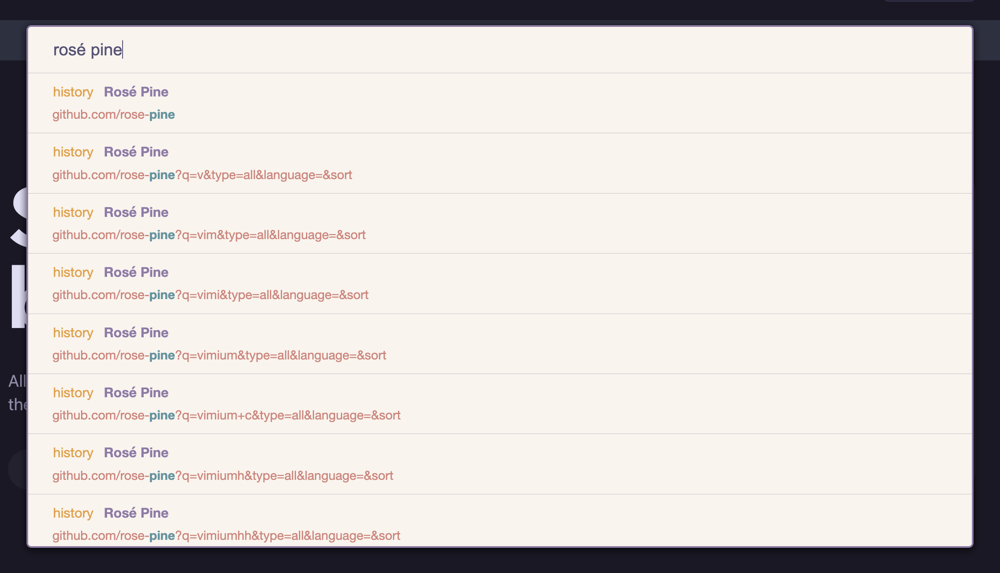
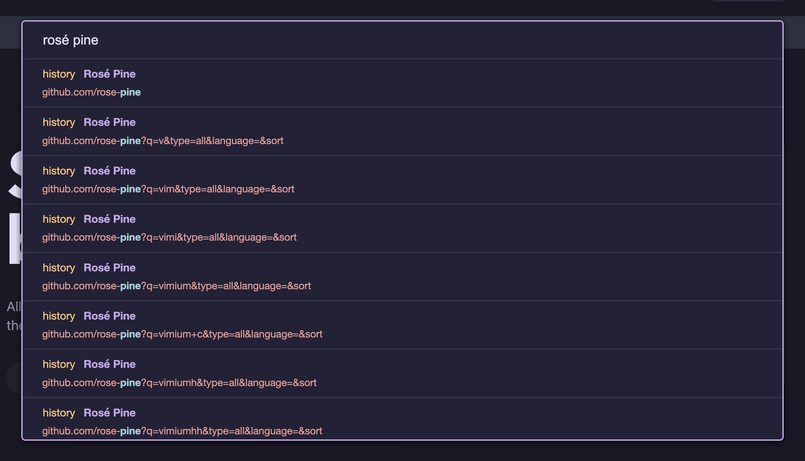

<h3 align="center">
	<br/>
	<br/>
	Rosé Pine for <a href="https://chrome.google.com/webstore/detail/vimium/dbepggeogbaibhgnhhndojpepiihcmeb">Vimium</a>
</h3>

<p align="center">
  All natural pine, faux fur and a bit of soho vibes for the classy minimalist
</p>

## Variants

### 🌲 Rosé Pine <small>(Dark, warm base)</small>



### 🌅 Rosé Pine Dawn <small>(Light, soft morning tones)</small>

<details>
<summary>Click to expand preview </summary>



</details>

### 🌙 Rosé Pine Moon <small>(Dark, cooler alternative)</small>

<details>
<summary>Click to expand preview </summary>



</details>

## Color Roles

Each theme uses the following Rosé Pine palette roles:

| Role      | Usage                                           |
| --------- | ----------------------------------------------- |
| `pine`    | Titles, Vim keys, focused borders               |
| `iris`    | Vomnibar border, links                          |
| `foam`    | Link hints, URL match highlights                |
| `gold`    | Source labels, text selection                   |
| `rose`    | URL text                                        |
| `text`    | Default text                                    |
| `surface` | Slightly elevated backgrounds (dialogs, inputs) |
| `base`    | Main background                                 |

## Usage

1. Open Vimium's Options page.
1. Scroll down to the **"CSS for Vimium UI"** textbox.
1. Copy the content of your chosen variant from the [themes](./themes) folder:
   - [`themes/rose-pine.css`](./themes/rose-pine.css) — Rosé Pine (dark)
   - [`themes/rose-pine-moon.css`](./themes/rose-pine-moon.css) — Rosé Pine Moon (dark)
   - [`themes/rose-pine-dawn.css`](./themes/rose-pine-dawn.css) — Rosé Pine Dawn (light)
1. Paste it into the textbox, save changes, and restart your browser.

## Building from template

The `template.css` file uses [`@rose-pine/build`](https://github.com/rose-pine/build) variable syntax and can be used to regenerate the theme variants:

```sh
npx @rose-pine/build@latest -s false -p _ -t template.css
```

## Thanks to

- [rose-pine](https://github.com/rose-pine) — for the beautiful color palette
- [rose-pine/vimium-c](https://github.com/rose-pine/vimium-c) — for the Vimium C implementation that inspired this port

&nbsp;

<p align="center">
  <a href="https://github.com/rose-pine/rose-pine-theme">
    
  </a>
</p>
<p align="center"><a href="./LICENSE"></a></p>
